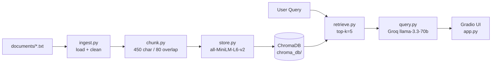

# Project 1 Planning: The Unofficial Guide

> Write this document before you write any pipeline code.
> Your spec and architecture diagram are what you'll use to direct AI tools (Claude, Copilot, etc.) to generate your implementation — the more specific they are, the more useful the generated code will be.
> Update the Retrieval Approach and Chunking Strategy sections if you change your approach during implementation.
> Update this file before starting any stretch features.

---

## Domain

**UC Berkeley unofficial student knowledge: dining halls, housing, CS courses, and campus survival.**

This domain covers the practical information students share on Reddit, Rate My Professors, and housing forums — not what appears in official university brochures. Official dining pages list hours and menus but not realistic wait times, which stations to avoid, or which hall handles dietary restrictions best. The housing lottery page describes the process but not how priority tiers actually work or what students do with bad lottery numbers. CS course catalogs list prerequisites but not exam difficulty, project hours, or which instructors give useful feedback. This knowledge is scattered across dozens of threads and review sites, making it hard to search with a single question.

---

## Documents

| # | Source | Description | URL or location |
|---|--------|-------------|-----------------|
| 1 | r/berkeley | Crossroads dining hall wait times and food quality | documents/reddit_crossroads_dining.txt |
| 2 | r/berkeley | Foothill dining — worth the walk, coffee, dietary options | documents/reddit_foothill_dining.txt |
| 3 | r/berkeley | Clark Kerr dining — small hall, brunch, vegan options | documents/reddit_clark_kerr_dining.txt |
| 4 | Rate My Professors | CS 61A instructor reviews (Weaver, DeNero) | documents/rmp_cs61a_de_novo.txt |
| 5 | Rate My Professors | CS 61B Josh Hug reviews — projects, feedback, grading | documents/rmp_cs61b_hug.txt |
| 6 | Rate My Professors | CS 70 discrete math — proof difficulty, curves | documents/rmp_cs70_wu_yan.txt |
| 7 | Housing forum / r/berkeley | On-campus housing lottery FAQ — randomness, priority | documents/housing_lottery_guide.txt |
| 8 | r/berkeley | Off-campus southside housing — rent, mold warnings | documents/off_campus_southside_housing.txt |
| 9 | r/berkeley | Bear Transit routes, schedules, night shuttle | documents/reddit_bear_transit_tips.txt |
| 10 | Orientation Discord / wiki | Freshman survival guide — enrollment, health, finals | documents/freshman_survival_guide.txt |
| 11 | r/berkeley | RSO and CS club recommendations | documents/reddit_rso_recommendations.txt |
| 12 | Rate My Professors | Upper division EECS (162, 161, 188) workload | documents/rmp_eecs_upper_div.txt |

---

## Chunking Strategy

**Chunk size:** 450 characters (approximately 90–110 tokens)

**Overlap:** 80 characters

**Reasoning:**

My documents are a mix of short Reddit posts (1–4 sentences each) and longer FAQ/guide sections (multi-paragraph). A 450-character chunk keeps most individual Reddit posts intact while allowing longer guide sections to split at natural boundaries. Smaller chunks (under 200 characters) would fragment posts like "Wait times at Foothill are rarely over 10 minutes" from their context about which dining hall is being discussed. Larger chunks (over 600 characters) would merge unrelated Reddit comments from the same thread, diluting embeddings.

Overlap of 80 characters ensures that when a key fact spans a chunk boundary — for example, a professor's exam difficulty mentioned at the end of one review and the study advice in the next — both chunks share enough text for semantic search to match either one.

Splitting respects paragraph boundaries first (`\n\n`), then sentence boundaries (`. `), before falling back to fixed-width splits. This prevents mid-word cuts and keeps "Professor Hug's 61B is hard but fair" together.

---

## Retrieval Approach

**Embedding model:** `all-MiniLM-L6-v2` via sentence-transformers (384-dimensional embeddings, runs locally)

**Top-k:** 5 chunks per query

**Production tradeoff reflection:**

For production with unlimited budget, I would evaluate: (1) **Accuracy** — domain-specific models like `e5-large-v2` or OpenAI `text-embedding-3-large` handle informal student slang and course codes better; (2) **Context length** — longer documents would benefit from models supporting 512+ token inputs per chunk; (3) **Multilingual support** — Berkeley has many international students posting in mixed languages, which MiniLM handles poorly; (4) **Latency vs. local** — MiniLM runs on CPU in ~50ms per query, while API models add network latency but scale horizontally; (5) **Cost at scale** — MiniLM is free locally; API embeddings at millions of queries/month add up.

Five chunks balances context richness against noise. Fewer than 3 risks missing the relevant review buried in a thread; more than 7 dilutes the LLM prompt with loosely related dining or housing content.

---

## Evaluation Plan

| # | Question | Expected answer |
|---|----------|-----------------|
| 1 | What do students say about wait times at Crossroads during lunch? | Lunch rush 12–1:30 pm brings 20–25 minute waits for hot food; shorter lines before noon, after 2 pm, or at the salad bar. |
| 2 | Which CS professor gives the most useful feedback according to reviews? | Josh Hug (CS 61B) — reviewers praise detailed autograder feedback, written style comments, and accessible office hours. |
| 3 | Is the Berkeley housing lottery completely random? | No — lottery numbers are random within class year, but re-applicants get priority over new applicants; disabled students and athletes have separate processes. |
| 4 | What mold-related warning do students give about off-campus housing? | Several units in the Dwight-Telegraph corridor have mold complaints; students advise asking about ventilation, checking for musty smells during tours, and documenting move-in conditions. |
| 5 | How long does the CS 162 Pintos project take according to reviews? | 40+ hours; students recommend starting project 2 the day it is released. |

---

## Anticipated Challenges

1. **Cross-topic retrieval noise:** Documents cover dining, housing, and CS courses in one corpus. A query about "CS 61B projects" might retrieve CS 162 project advice because both mention "projects" and "hours." Mitigation: include source metadata in context and use specific queries in evaluation.

2. **Chunk boundary splits on Reddit threads:** A reply that says "avoid the international station on Mondays" might lose the "Crossroads" context if the parent comment was in the previous chunk. Mitigation: 80-character overlap and preserving `u/username:` lines in chunk text so the thread context travels with each chunk.

---

## Architecture

| Stage | Tool / Library |
|-------|----------------|
| Document Ingestion | Python `pathlib`, regex cleaning in `ingest.py` |
| Chunking | Custom paragraph/sentence splitter in `chunk.py` |
| Embedding + Vector Store | sentence-transformers + ChromaDB |
| Retrieval | ChromaDB cosine similarity, k=5 |
| Generation | Groq API (`llama-3.3-70b-versatile`) |

---

## AI Tool Plan

**Milestone 3 — Ingestion and chunking:**

- **Tool:** Cursor AI (Claude)
- **Input:** Documents table, Chunking Strategy section, architecture diagram
- **Expected output:** `ingest.py` (load `.txt` from `documents/`, strip boilerplate headers, normalize whitespace) and `chunk.py` (450/80 split with paragraph/sentence awareness)
- **Verification:** Print 5 sample chunks; confirm no HTML artifacts, each chunk readable standalone, chunk count between 50–2000

**Milestone 4 — Embedding and retrieval:**

- **Tool:** Cursor AI (Claude)
- **Input:** Retrieval Approach section, architecture diagram, chunk output format
- **Expected output:** `store.py` (embed with MiniLM, persist to ChromaDB with source + chunk_index metadata) and `retrieve.py` (query function returning chunks + distances)
- **Verification:** Run 3 evaluation queries; top result distance below 0.5, chunks visibly on-topic

**Milestone 5 — Generation and interface:**

- **Tool:** Cursor AI (Claude)
- **Input:** Grounding requirements, Groq model name, Gradio skeleton from assignment
- **Expected output:** `query.py` (grounded prompt + source attribution) and `app.py` (Gradio Blocks UI)
- **Verification:** End-to-end test — grounded answer cites sources; out-of-scope question returns refusal
